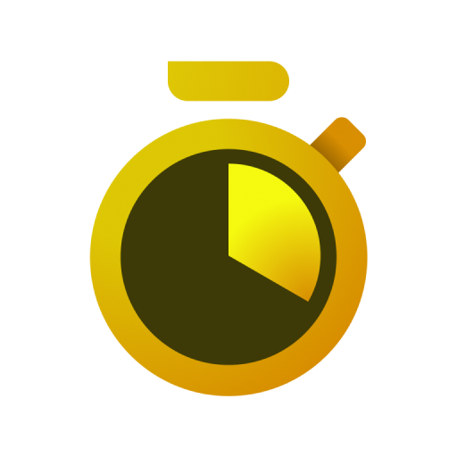
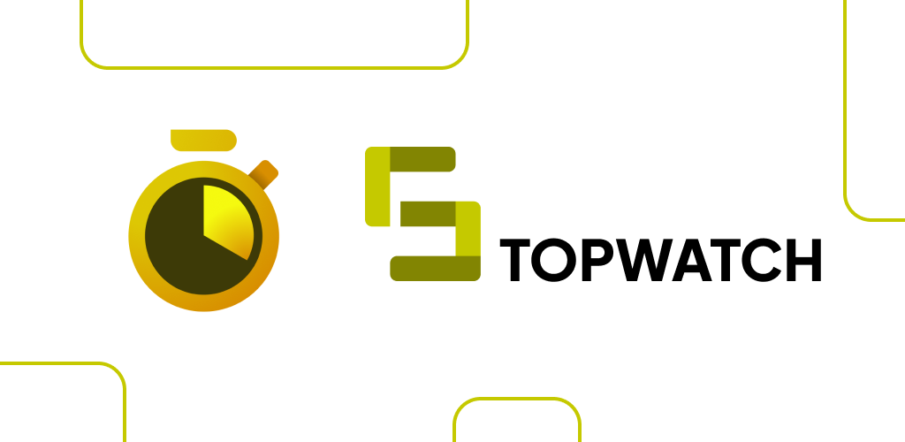
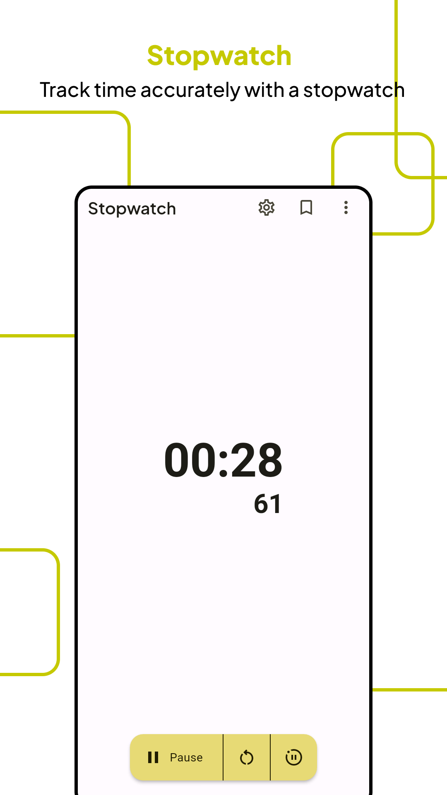
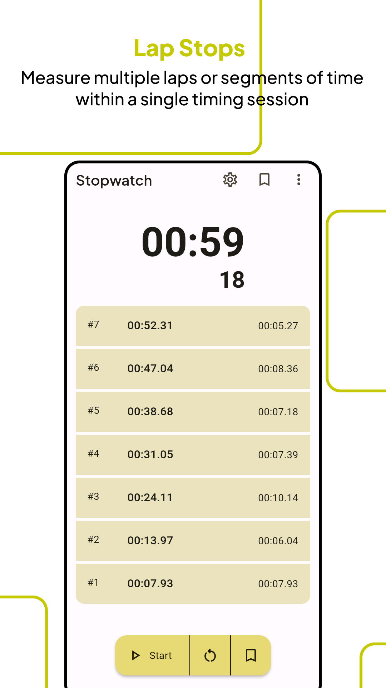
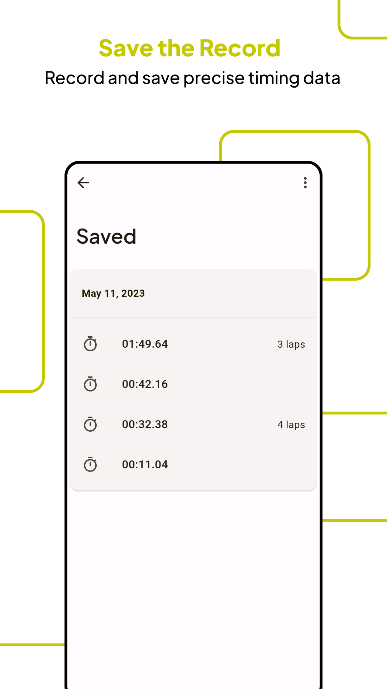
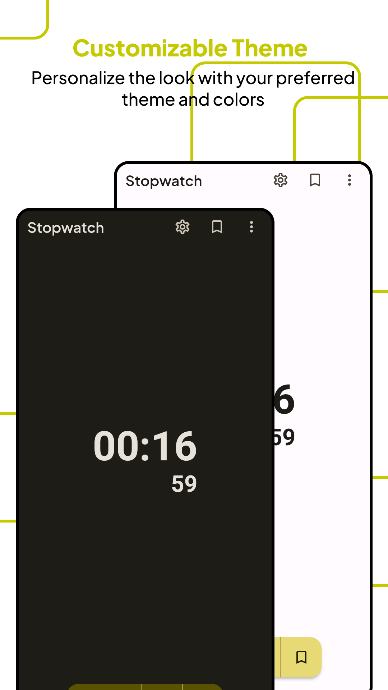

# Stopwatch

## Header

## Screenshot

## What's new

- Bug fix

## Description

> Play store link: [Stopwatch](https://play.google.com/store/apps/details?id=com.redmerah.stopwatch) (not available anymore)

Stopwatch is a simple yet powerful app that lets you keep track of time with ease. Whether you need to time your workout, your cooking, or any other activity, Stopwatch has got you covered.

With its intuitive interface, Stopwatch makes it easy to start, stop, and add lap times to your stopwatch. You can even save your stopwatch records for future reference. Whether you want to keep track of your personal best or compare your times with friends, Stopwatch has you covered.

But that's not all. Stopwatch also lets you customize its appearance with a variety of themes. Whether you prefer a dark or light mode, or want to match your app to your favorite color, Stopwatch has a theme for you.

Stopwatch is the perfect app for anyone who needs a simple and reliable stopwatch. Download it now and start timing your life today!
